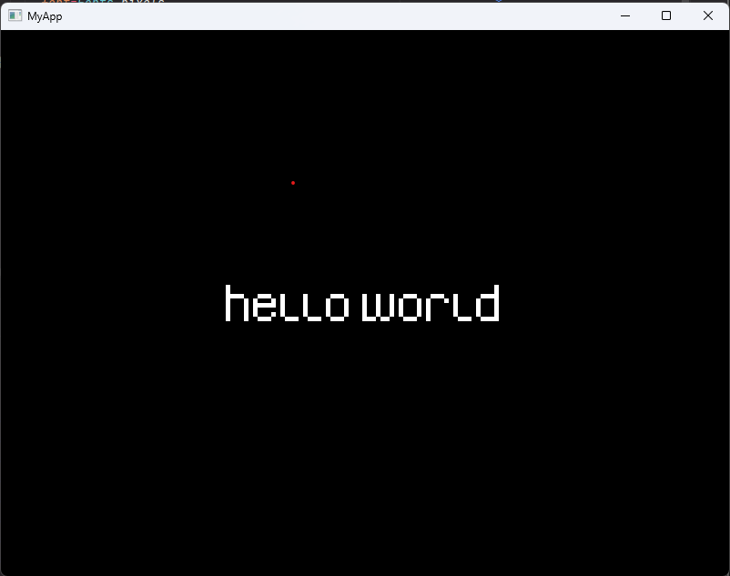

# Widget
Widget is the most basic building component of the ui.
UI is structured as a tree, widget is a node of that tree.
Everything you see on screen is a widget (text, input, button, app bar, invisible widget that organizes other into a column...).

## Create a window and display something

In order to display anything on the screen you need to:
1. Define a widget that is made up of other widgets
2. Display it on the screen using `runApp`function

```scala
package com.matf.helloworld

import com.matf.ui.utils.context.BuildContext
import com.matf.ui.utils.data.Colors
import com.matf.ui.utils.font.Fonts
import com.matf.ui.{Widget, runApp}
import com.matf.ui.widgets.{Center, StatelessWidget, Text, TextStyle}
import com.systemvi.engine.utils.Utils

object Main{
  Utils.assetsFolder="../"
  def main(args:Array[String]): Unit = {
    runApp("MyApp",new MyApp())
  }
}

class MyApp extends StatelessWidget{
  override def build(context:BuildContext):Widget={
    Center(
      child=Text(
        "hello world",
        style=TextStyle(color=Colors.white),
        font=Fonts.pixels
      )
    )
  }
}
```
And the result is:


Class `Widget` only has two classes that directly extend it, `StatefulWidget` and `StatelessWidget`.
All other class extend one of these two.
<br>
<br>
UI has nice declarative syntax that resembles the order of things on the screen.
Almost all widgets either have `child`, `children` or some kind of style parameters, depending on wether 
they have only one child (Center), multiple (Row, Stack, Column) or none (Text, Switch, Slider).